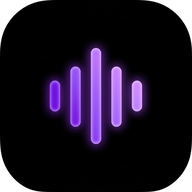
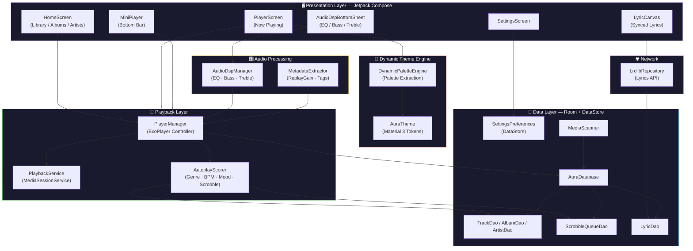
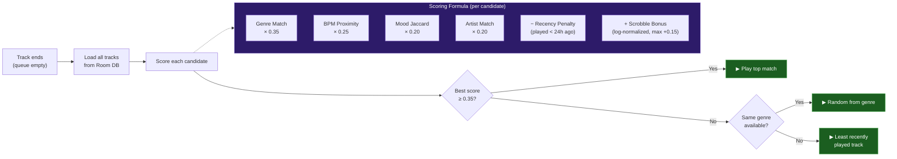
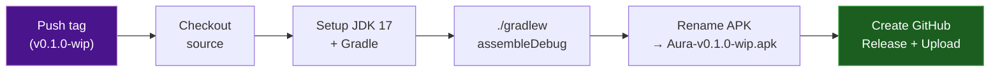

<p align="center">
  
</p>

<h1 align="center">Aura Player</h1>

<p align="center">
  <strong>A hi-fi local music player for Android — built with love for audiophiles.</strong>
</p>

<p align="center">
  
  
  
  
  
</p>

<p align="center">
  <em>Aura scans your local music library, plays hi-res audio formats, extracts synced lyrics,<br/>and adapts its entire colour palette to your album artwork — all offline.</em>
</p>

---

## ✨ Features at a Glance

| Feature | Description |
|:---|:---|
| 🎵 **Hi-Res Playback** | FLAC, WAV, MP3, AIFF, OGG — powered by ExoPlayer (Media3) |
| 🎨 **Dynamic Theming** | Album art palette extraction with smooth animated colour transitions |
| 🌊 **Brownian Motion BG** | Organic blurred gradient that slowly shifts behind the player |
| 📝 **Synced Lyrics** | Line-synced + word-level karaoke highlighting (LRCLib + embedded tags) |
| 🎛️ **Audio DSP** | 16-band parametric EQ (31 Hz – 16 kHz), Bass Boost, Treble & Limiter |
| 🔊 **ReplayGain** | Track/album gain normalisation with anti-clipping protection |
| 🤖 **Smart Autoplay** | Picks the next track based on genre, BPM, mood, and listening history |
| 🔀 **Shuffle** | True shuffle with active indicator dot |
| 🔔 **Media Controls** | Lock-screen controls + persistent notification via MediaSession |
| 📂 **Library Scanning** | Auto-scans MediaStore with blacklist folder support |

---

## 🏗️ Architecture



---

## 🤖 How Autoplay Works

When the current queue runs out, Aura's **AutoplayScorer** picks the best next track from your entire library — completely offline.



The more you listen, the smarter it gets — every track played past **50%** gets its `lastPlayedTimestamp` updated, which feeds back into the recency penalty so you hear fresh songs.

---

## 📝 Lyrics Engine

Aura supports three levels of lyric precision:

```
┌─────────────────────────────────────────────────┐
│               LYRICS RESOLUTION                 │
├─────────────┬───────────────┬───────────────────┤
│  Plain      │  Line-synced  │  Word-level       │
│  (static)   │  (auto-scroll)│  (karaoke glow)   │
│             │               │                   │
│  Fallback   │  [mm:ss.xx]   │  <mm:ss.xx> per   │
│  display    │  LRC format   │  word token       │
└─────────────┴───────────────┴───────────────────┘

Priority:  Embedded tags  →  LRCLib API  →  Plain text
```

- **Embedded**: Reads `LYRICS` / `USLT` tags directly from audio files via jaudiotagger
- **LRCLib**: Fetches synced lyrics from [lrclib.net](https://lrclib.net) (free, no API key)
- **Word-level**: Enhanced LRC with `<mm:ss.xx>` inline timestamps for karaoke-style per-word highlighting

---

## 🎛️ Audio DSP

| Control | Range | Engine |
|:---|:---|:---|
| **16-Band EQ** | ±15 dB per band (31 Hz → 16 kHz) | Android `DynamicsProcessing` (or system `Equalizer` fallback) |
| **Bass Boost** | 0 – 12 dB boost | DynamicsProcessing low-shelf filter |
| **Treble** | 0 – 12 dB boost | DynamicsProcessing high-shelf filter |
| **Limiter** | Configurable threshold (dB) | DynamicsProcessing peak limiter |
| **ReplayGain** | −12 to +12 dB | jaudiotagger tag extraction |

---

## 📂 Project Structure

```
app/src/main/java/com/auraplayer/app/
├── 🎵 playback/
│   ├── PlayerManager.kt          # ExoPlayer lifecycle, autoplay, shuffle
│   ├── PlayerState.kt            # PlayerUiState data class
│   ├── AutoplayScorer.kt         # Offline recommendation engine
│   └── PlaybackService.kt        # MediaSessionService for notifications
│
├── 🎨 ui/
│   ├── HomeScreen.kt             # Library browser (tracks / albums / artists)
│   ├── PlayerScreen.kt           # Full-screen now-playing with controls
│   ├── LyricCanvas.kt            # Synced lyrics with karaoke highlighting
│   ├── MiniPlayer.kt             # Persistent bottom bar mini-player
│   ├── AudioDspBottomSheet.kt    # EQ / Bass / Treble controls
│   ├── SettingsScreen.kt         # Preferences & scan management
│   ├── DynamicPaletteEngine.kt   # Album art → colour palette extraction
│   └── AuraTheme.kt              # Material 3 dynamic theme tokens
│
├── 🎛️ audio/
│   └── AudioDspManager.kt        # 16-band EQ, BassBoost, Treble & Limiter
│
├── 📝 lyrics/
│   ├── LrcParser.kt              # LRC + enhanced word-level parser
│   └── LrcModels.kt              # LyricLine / LyricToken data models
│
├── 🔍 metadata/
│   └── MetadataExtractor.kt      # jaudiotagger: ReplayGain, codec, tags
│
├── 💾 data/
│   ├── AuraDatabase.kt           # Room database (v4)
│   ├── TrackEntities.kt          # Track / Album / Artist entities
│   ├── LibraryDaos.kt            # Track / Album / Artist DAOs
│   ├── LyricEntity.kt            # Cached lyrics entity
│   ├── LyricDao.kt               # Lyrics DAO
│   ├── MediaScanner.kt           # MediaStore scanner with blacklisting
│   └── SettingsPreferences.kt    # DataStore preferences wrapper
│
├── 📡 repository/
│   ├── LrclibRepository.kt       # LRCLib.net API client (Ktor)
│   └── MusicRepository.kt        # Library scan orchestrator
│
├── 📊 scrobble/
│   ├── ScrobbleQueueEntity.kt    # Room entity for offline scrobble queue
│   ├── ScrobbleQueueDao.kt       # Scrobble DAO (frequency queries for autoplay)
│   ├── ScrobbleValidator.kt      # 50% play-time validation logic
│   └── ScrobbleWorker.kt         # WorkManager worker (stub — user-extensible)
│
├── AuraApplication.kt            # Application class
└── MainActivity.kt               # Single-activity Compose host
```

---

## 🛠️ Tech Stack

| Layer | Technology |
|:---|:---|
| **Language** | Kotlin 2.0 |
| **UI** | Jetpack Compose + Material 3 |
| **Playback** | Media3 ExoPlayer + MediaSession |
| **Audio Processing** | Android `DynamicsProcessing` (16-Band EQ + Limiter) |
| **Database** | Room (SQLite) |
| **Preferences** | DataStore |
| **Networking** | Ktor Client (OkHttp engine) |
| **Serialization** | kotlinx.serialization |
| **Background Work** | WorkManager |
| **Metadata** | jaudiotagger |
| **Palette** | AndroidX Palette |
| **Image Loading** | Coil Compose |
| **CI/CD** | GitHub Actions |
| **Min SDK** | 26 (Android 8.0 Oreo) |
| **Target SDK** | 35 (Android 15) |

---

## 🚀 Getting Started

### Prerequisites

- **Android Studio** Ladybug (2024.2) or newer
- **JDK 17**
- An Android device or emulator running **Android 8.0+**

### Build & Run

```bash
# Clone the repo
git clone https://github.com/Sayanthegamer/Aura-player.git
cd Aura-player

# Build debug APK
./gradlew assembleDebug

# Install on connected device
./gradlew installDebug
```

### Install from Releases

1. Head to the [Releases](../../releases) page
2. Download the latest `Aura-vX.X.X.apk`
3. Enable **Install unknown apps** on your Android device
4. Tap the APK → Install → Done!

---

## 🔄 CI/CD

Every push of a version tag (`v*`) triggers a GitHub Actions workflow that:



You can also trigger a build manually from the **Actions** tab → **Release APK** → **Run workflow**.

---

## 🗺️ Roadmap

> Aura is in active development. The UI will be completely rethought and redesigned.

- [ ] 🎨 Full UI/UX redesign (premium, expressive, Material You)
- [ ] 🎵 Gapless playback
- [ ] 📋 Queue management & drag-to-reorder
- [ ] 🔁 Repeat modes (one / all / off)
- [ ] ❤️ Favourites & playlists
- [ ] 🏷️ Tag editor (inline metadata editing)
- [ ] 📊 Listening statistics dashboard
- [ ] 🔗 Last.fm / ListenBrainz scrobble integration
- [ ] 🎨 Custom theme colour picker
- [ ] 🔍 Smart search with filters
- [ ] 📱 Tablet / foldable layout support
- [ ] 🚗 Android Auto integration

---

## 📄 License

This project is currently unlicensed / all rights reserved. A proper open-source license will be added once the project leaves WIP status.

---

<p align="center">
  <sub>Built with 💜 and Kotlin — one track at a time.</sub>
</p>
